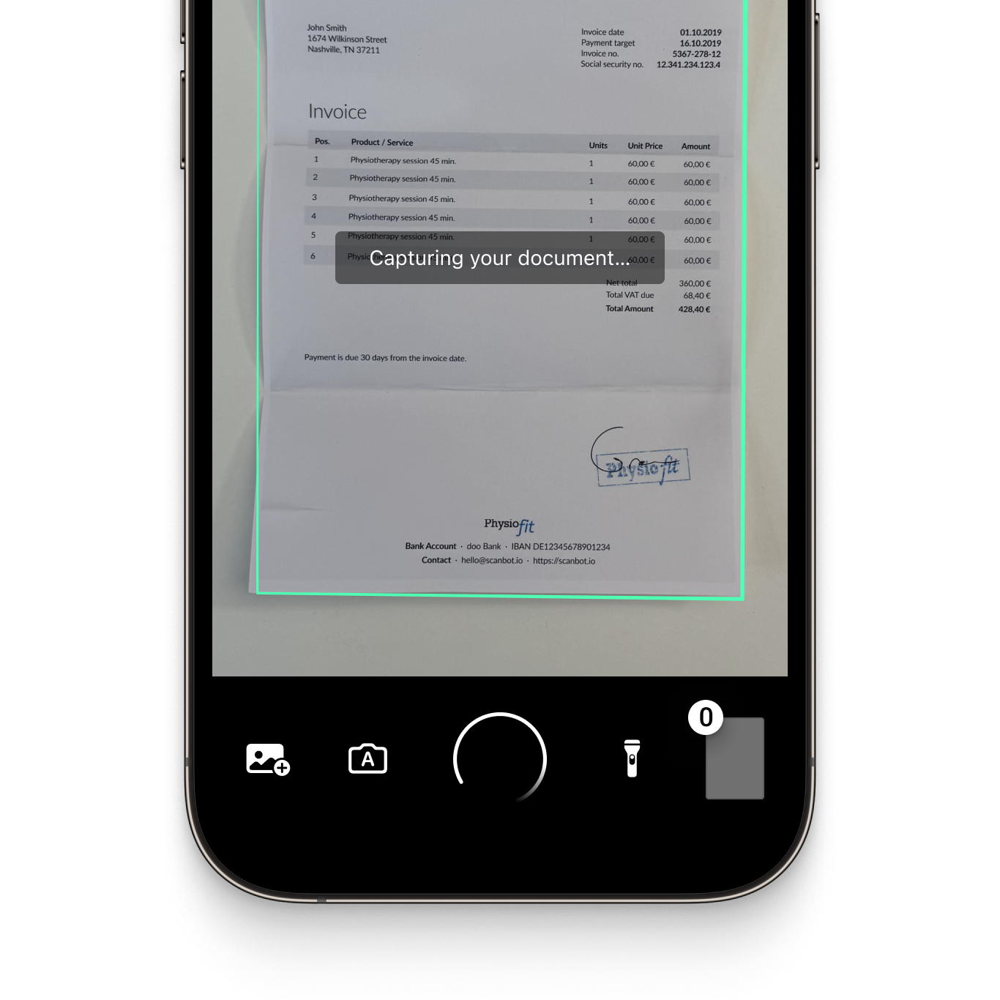
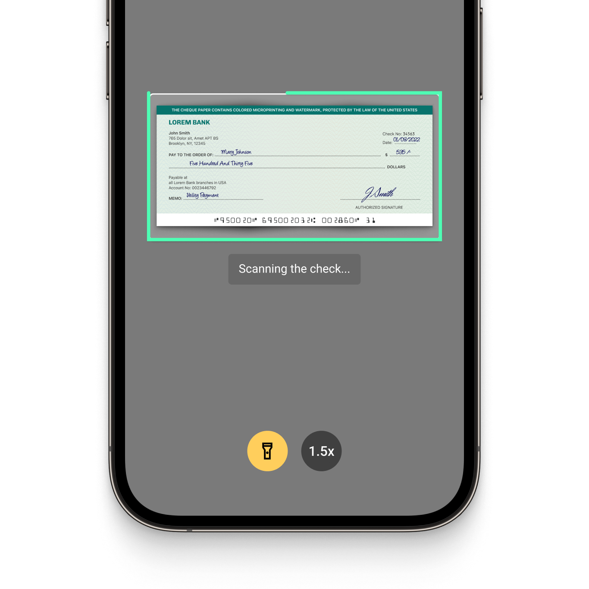

<p align="left">
  
</p>
<p align="left">
  
</p>

# Example app for the Scanbot Capacitor Ionic Document Scanner SDK and Data Capture Modules using React

This example app shows how to integrate the [Scanbot Document Scanner SDK](https://scanbot.io/document-scanner-sdk/?utm_source=github.com&utm_medium=referral&utm_campaign=dev_sites) and [Scanbot Data Capture Modules](https://scanbot.io/data-capture-software/?utm_source=github.com&utm_medium=referral&utm_campaign=dev_sites) for the Capacitor Ionic framework using React.

## What is the Scanbot SDK?

The Scanbot SDK is a set of high-level APIs that lets you integrate document scanning and intelligent data extraction into your mobile app or website. It runs on all common mobile devices and operates entirely offline. No data is transmitted to our or third-party servers, ensuring maximum data safety.

With our Ready-To-Use UI (RTU UI) components, you can integrate the Document Scanner SDK into your app in less than an hour. 

💡 For more details about the Scanbot Document Scanner SDK and Data Capture Modules, please check out our [documentation.](https://docs.scanbot.io/document-scanner-sdk/capacitor/introduction/?utm_source=github.com&utm_medium=referral&utm_campaign=dev_sites) 

## How to run this app

### Requirements

* NodeJS 18+ & npm
* [Capacitor CLI](https://www.npmjs.com/package/@capacitor/cli) 6+
* For Android apps:
	* Android Studio Jellyfish | 2023.1.1+
	* Android SDK (API Level 22+), Platforms and Developer Tools
	* Android Gradle Plugin 8.4.0+ or Kotlin Plugin applied
* For iOS apps:
	* iOS 13+
	* macOS with Xcode 15+
	* Xcode Command Line Tools
	* Homebrew
	* Cocoapods

Please check the full [requirements for Capacitor](https://capacitorjs.com/docs/getting-started/environment-setup).

>💡 For a full overview of our SDK's requirements, please refer to our [documentation](https://docs.scanbot.io/document-scanner-sdk/capacitor/introduction/#requirements).


### Install

Install the node modules of this project:

```
cd scanbot-sdk-example-ionic-react/
npm install
```

### Build

Build the web assets and sync with the Capacitor native projects:

```
npm run build
npx cap sync
```

### Run

Connect an Android or iOS device via USB and run the app from IDE or Command Line Interface (CLI).

#### IDE

Open the native projects in corresponding IDEs (Android Studio or Xcode) and hit the "Run" button:

```
npx cap open android
npx cap open ios
```

#### CLI

Or alternatively run the projects via CLI (Android or iOS):

```
npx cap run android
npx cap run ios
Overview of the Scanbot SDK
```

## Overview of the Scanbot SDK

### Document Scanner SDK

The Scanbot Capacitor Document Scanner SDK offers the following features:

* **User guidance**: Ease of use is crucial for large user bases. Our on-screen user guidance helps even non-tech-savvy users scan documents with ease.

* **Automatic document scanning**: The SDK's automatic document detection automatically captures the scan when the device is optimally positioned. This reduces the risk of blurry or incomplete document scans compared to manually triggered capture.

* **Automatic cropping**: Our SDK automatically straightens and crops the scans, ensuring high-quality document scans and smooth image processing at all times.

* **Custom filters:** Every use case has specific image requirements. With the SDK’s custom filters, you can turn the captured document image into optimal input for your backend systems. They include grayscale, several binarization options, and more.

* **Document Quality Analyzer:** This feature automatically rates the quality of the scanned pages from “very poor” to “excellent.” If the quality is below a specified threshold, the SDK prompts the user to rescan.

* **Export formats:** The Scanbot Document Scanner SDK supports several output formats (JPG, PDF, TIFF, and PNG). This ensures your downstream solutions receive the best format to store, print, or share the digitized document – or to process it further.

|  |  |  |
| :-- | :-- | :-- |

### Data Capture Modules

The Scanbot SDK Data Capture Modules allow you to extract data from a wide range of structured documents and to integrate OCR text recognition capabilities. They include:

#### [MRZ Scanner](https://scanbot.io/data-capture-software/mrz-scanner/?utm_source=github.com&utm_medium=referral&utm_campaign=dev_sites)
This module allows quick and accurate data extraction from the machine-readable zones on identity documents. It captures all important MRZ data from IDs and passports and returns it in the form of simple key-value pairs. This is much simpler, faster, and less mistake-prone than manual data entry.

#### [Check Scanner (MICR)](https://scanbot.io/data-capture-software/check-scanner/?utm_source=github.com&utm_medium=referral&utm_campaign=dev_sites)
The MICR Scanner offers reliable data extraction from international paper checks, capturing check numbers, routing numbers, and account numbers from MICR codes. This simplifies workflows and reduces errors that frustrate customers and employees.

#### [VIN Scanner](https://scanbot.io/data-capture-software/vin-scanner/?utm_source=github.com&utm_medium=referral&utm_campaign=dev_sites)
The VIN scanner enables instant capture of vehicle identification numbers (VINs) from trucks or car doors. It uses OCR to convert the image of the VIN code into structured data for backend processing. This module integrates into mobile or web-based fleet management applications, enabling you to replace error-prone manual entry with fast, reliable data extraction.

#### Generic Document Recognizer
Through this feature, our Document Scanner SDK offers document detection and data capture capabilities for a wider range of documents. It accurately identifies and crops various standardized document types including[ German ID cards](https://scanbot.io/data-capture-software/id-scanner/?utm_source=github.com&utm_medium=referral&utm_campaign=dev_sites), passports,[ driver's licenses](https://scanbot.io/data-capture-software/german-drivers-license-scanner/?utm_source=github.com&utm_medium=referral&utm_campaign=dev_sites),[ residence permits](https://scanbot.io/data-capture-software/residence-permit-scanner/?utm_source=github.com&utm_medium=referral&utm_campaign=dev_sites), and the[ EHIC](https://scanbot.io/data-capture-software/ehic-scanner/?utm_source=github.com&utm_medium=referral&utm_campaign=dev_sites). It uses the Scanbot OCR engine for accurate data field recognition, without requiring additional OCR language files.

|  |  |  |
| :-- | :-- | :-- |

## Additional information

### Free integration support

Need help integrating or testing our Document Scanner SDK? We offer [free](https://docs.scanbot.io/support/?utm_source=github.com&utm_medium=referral&utm_campaign=dev_sites) technical support from our developers via Slack, MS Teams, or email.

As a customer, you also get access to a dedicated support Slack or Microsoft Teams channel to talk directly to your Customer Success Manager and our engineers.

### Trial license and pricing

The Scanbot SDK examples will run one minute per session without a trial license key. After that, all functionalities and UI components will stop working. 

To try the Scanbot Capacitor SDK without the one-minute limit, you can request a free, no-strings-attached [7-day](https://scanbot.io/trial/?utm_source=github.com&utm_medium=referral&utm_campaign=dev_sites) trial license for your example project.

Our pricing model is simple: Unlimited scanning for a flat annual license fee, full support included. There are no tiers, usage charges, or extra fees. [Contact](https://scanbot.io/contact-sales/?utm_source=github.com&utm_medium=referral&utm_campaign=dev_sites) our team to receive your quote and paid license. 

### Other supported platforms

Besides Capacitor, the Scanbot SDK is also available on:

* [Android](https://github.com/doo/scanbot-sdk-example-android) (native)
* [iOS](https://github.com/doo/scanbot-sdk-example-ios) (native)
* [Flutter](https://github.com/doo/scanbot-sdk-example-flutter)
* [Capacitor & Ionic (Vue.js)](https://github.com/doo/scanbot-sdk-example-ionic-vuejs)
* [Capacitor & Ionic (Angular)](https://github.com/doo/scanbot-sdk-example-capacitor-ionic)
* [Cordova & Ionic](https://github.com/doo/scanbot-sdk-example-ionic) 
* [.NET MAUI](https://github.com/doo/scanbot-sdk-maui-example)
* [JavaScript](https://github.com/doo/scanbot-sdk-example-web)
* [React Native](https://github.com/doo/scanbot-sdk-example-react-native)
* [Xamarin](https://github.com/doo/scanbot-sdk-example-xamarin) & [Xamarin.Forms](https://github.com/doo/scanbot-sdk-example-xamarin-forms)

Our Barcode Scanner SDK additionally also supports [Compose Multiplatform / KMP](https://github.com/doo/scanbot-barcode-scanner-sdk-example-kmp), [UWP](https://github.com/doo/scanbot-barcode-scanner-sdk-example-windows) (Windows), and [Linux](https://github.com/doo/scanbot-sdk-example-linux).